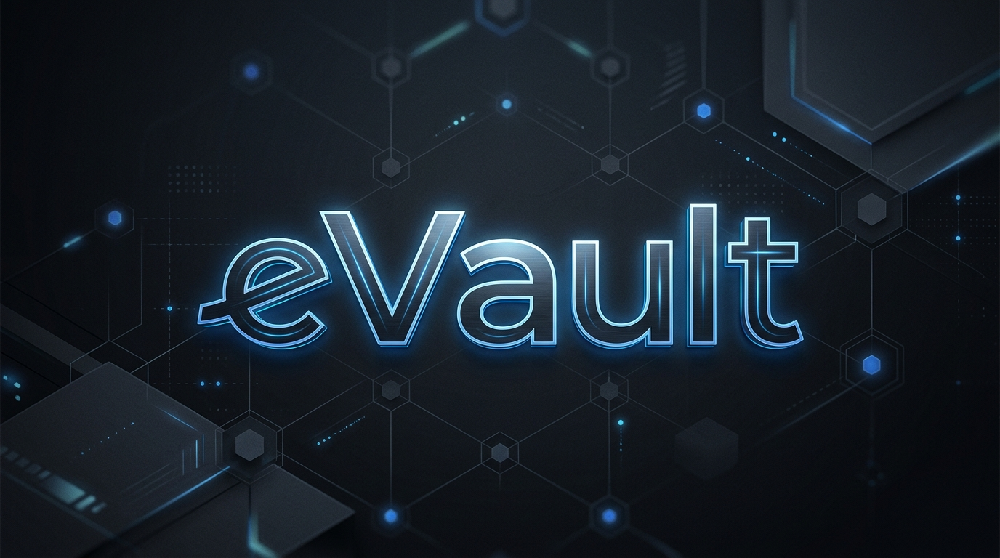
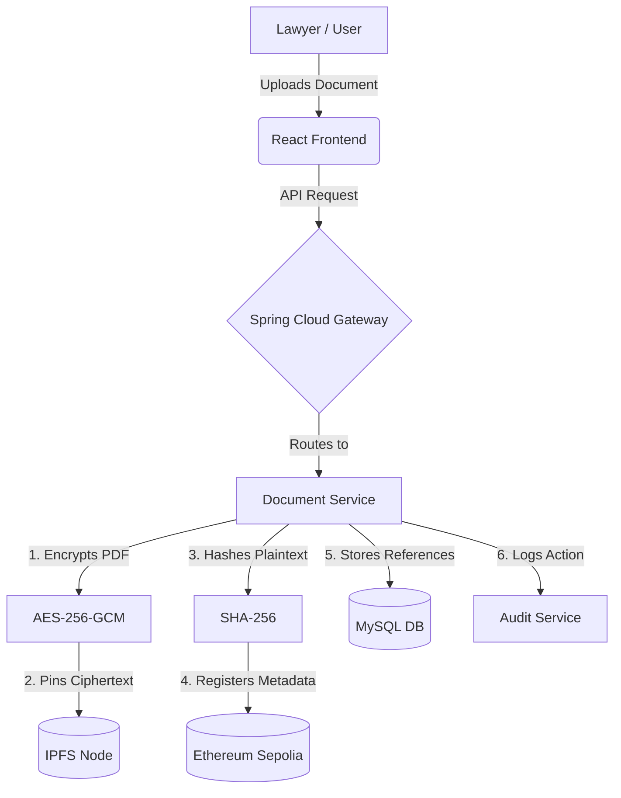

<div align="center">
  
  <br/>
  <p><strong>A secure, blockchain-backed legal document vault for the storage, sharing, and integrity verification of case records.</strong></p>
</div>

---

## About The Project

**eVault** is a microservices-based functional prototype engineered to address critical data integrity and privacy challenges in the legal sector. It was specifically designed to fulfill the requirements of the Ministry of Law & Justice under the Smart India Hackathon (SIH). 

The platform provides a highly secure, multi-stakeholder ecosystem that completely isolates document storage from metadata verification:
- **Lawyers** can securely file, classify, and encrypt legal documents, subsequently granting time-bounded access to specific individuals.
- **Judges** operate in a dedicated workspace to register official, sealed judicial orders directly against active case IDs.
- **Citizens / Clients** can seamlessly retrieve their authorized records and independently verify that no tampering has occurred.
- **Administrators and Auditors** have access to an immutable-style audit trail of all sensitive system actions (uploads, downloads, shares, and verifications).

By combining the immutability of the Ethereum blockchain (via the Sepolia testnet) with the decentralized storage capabilities of IPFS (Pinata) and military-grade AES-256-GCM encryption, eVault guarantees that legal documents cannot be lost, disputed, or accessed without explicit cryptographic authorization.

### The Problem vs. Our Approach

| Industry Problem | The eVault Solution |
|------------------|---------------------|
| **Lost or disputed case files** | SHA-256 integrity hashing combined with Ethereum (Sepolia) metadata registration. Any tampering breaks the hash match. |
| **Informal and insecure sharing** (Email, USB) | Wallet-based JWT authentication and explicit on-chain cryptographic access grants. |
| **Data privacy of legal PDFs** | AES-256-GCM server-side encryption before upload; IPFS stores **ciphertext only**. |
| **Siloed court systems** | Built-in SQLite/FastAPI case registry and APIs designed for seamless eCourts and CMS integration. |

> **Crucial Design Rule:** PDF documents and plaintext bytes *never* touch the blockchain. The blockchain exclusively holds the content identifier (CID), case ID, document type, timestamps, role permissions, and integrity metadata.

---

## Stakeholders and Core Workflows

The system is designed around explicit user roles enforced both at the API gateway layer and on the `eVault.sol` smart contract:

1. **Secure File Upload:** A lawyer uploads a PDF. The system classifies it, encrypts it, pins the ciphertext to IPFS, registers the metadata on the blockchain, logs it in MySQL, and generates an audit trail.
2. **Authorized Retrieval:** An authorized wallet requests the document. The system verifies JWT authorization before decrypting and serving the PDF.
3. **Secure Sharing:** The document owner grants time-bounded access to another wallet address.
4. **Zero-Knowledge Verification:** Any user can verify document integrity by comparing the MySQL metadata against the immutable Sepolia state without decrypting or viewing the actual PDF.

### Document Upload Flow



---

## Core Features

- **Encrypted Lawyer Filing** — Documents are encrypted server-side with AES-256-GCM before being pinned to IPFS. The metadata is registered on the Sepolia testnet to establish an immutable timeline.
- **Dedicated Judge Workspace** — A specialized, authenticated interface for the judiciary to register orders directly against specific case IDs within the vault.
- **Secure Citizen Vault** — Allows end-users to load their specific cases by ID, verify document integrity mathematically, and securely download files they have been granted access to.
- **Immutable Audit Trail** — A dedicated Spring Boot microservice logs every upload, share, download, denial, and verification event for absolute accountability.
- **Privacy-Preserving Identity Commitment** — Advanced wallet binding that verifies a user's identity using HMAC-based commitments. This ensures verified identity without ever storing raw sensitive Aadhaar or PII in the vault database.
- **Intelligent Case Registry** — An eCourts-style case list for streamlined filing and alignment, bridging the gap between blockchain storage and traditional court management systems.
- **AI Document Classifier** — Automatically assists with document typing and classification prior to secure upload, ensuring metadata remains clean and standardized.

---

## System Architecture

The application is built on a robust, microservices-driven architecture.

```text
[ React UI ] (Port: 3000)
      │
[ Spring Cloud Gateway ] (Port: 8080)
      │
      ├── Auth Service (8081)           -> MetaMask Integration & JWT Issuance
      ├── Document Service (8082)       -> AES Encryption · IPFS Pinning · MySQL · Verify/Download
      ├── Blockchain Service (8083)     -> eVault.sol Smart Contract on Ethereum (Sepolia)
      ├── Audit Service (8084)          -> Append-only Event Trail Management
      ├── Notification Service (8085)   -> Optional Alerts and Notifications
      └── Integration Service (8086)    -> eCourts Registry · AI Classifier · Identity Commitment
```

### Technology Stack

| Component | Port | Technologies Used |
|-----------|------|-------------------|
| **Frontend** | `3000` | React.js, Vite |
| **API Gateway** | `8080` | Spring Cloud Gateway |
| **Auth** | `8081` | Spring Boot, Java |
| **Documents** | `8082` | FastAPI, Python, MySQL, Pinata/IPFS |
| **Blockchain** | `8083` | Node.js, ethers.js |
| **Audit** | `8084` | Spring Boot, Java |
| **Notifications**| `8085` | Spring Boot, Java |
| **Integration** | `8086` | FastAPI, Python, SQLite |

---

## Security Model

The security of the documents is the primary focus of eVault. The flow ensures zero-knowledge storage:

1. **Encryption:** The PDF is encrypted with AES-256-GCM. A per-document key is derived via HKDF-SHA256 from the server's `ENCRYPTION_MASTER_KEY` combined with a unique version reference.
2. **Storage:** The resulting ciphertext is pinned to IPFS, which returns a unique CID.
3. **Registration:** The CID and the SHA-256 file hash of the plaintext are registered on the Sepolia network via the `eVault.sol` smart contract.
4. **Metadata Management:** Metadata is securely stored in a MySQL database. *The AES key is never stored in the database*, only the `encryption_key_reference`.
5. **Authorization:** Downloads are only permitted after strict JWT authorization (the requester must be the original uploader or hold a valid `DocumentAccess` grant).
6. **Verification:** The system verifies document integrity by comparing the MySQL metadata record against the blockchain state **without** needing to decrypt or download the actual PDF payload.

---

## Getting Started

### Prerequisites

- **Java 17+** (Required for Auth and Gateway services; *Java 21 required for Audit & Notifications if enabled*)
- **Python 3.12+**
- **Node.js 18+**
- **MySQL 8**
- **MetaMask Extension** + Sepolia test network configured for wallet authentication.

### Setup Instructions

1. **Configure Environment Variables:**
   Copy the provided template to create your local `.env` file:
   ```bash
   cp .env.example .env
   ```
   Fill in the required values:
   ```env
   ENCRYPTION_MASTER_KEY=64_hex_chars
   PINATA_JWT=your_jwt_here # Note: Use 'mock' for local-only IPFS testing
   SEPOLIA_RPC_URL=your_rpc_url
   PRIVATE_KEY=your_private_key
   CONTRACT_ADDRESS=your_contract_address
   JWT_SECRET=your_jwt_secret # Must strictly match the Auth service
   ```

2. **Start Services:**
   Follow the detailed start order outlined in **[START_ALL.md](./START_ALL.md)**. 
   *Important: The Gateway must be started last, followed by the Frontend.*
   *(Windows users can utilize `start-all.ps1` where available).*

3. **Launch the Application:**
   Navigate to **[http://localhost:3000](http://localhost:3000)** in your browser. Connect your MetaMask wallet, complete the identity binding process, and you can begin using the Document, Order, and Vault functionalities.

### Health Checks

During development, Vite proxies API requests (like `/api`, `/blockchain`, `/audit`, `/ecourts`) through the Spring Cloud Gateway (`:8080`).

| Microservice | Health Endpoint |
|--------------|-----------------|
| **Gateway** | [http://localhost:8080/actuator/health](http://localhost:8080/actuator/health) |
| **Documents** | [http://localhost:8082/health](http://localhost:8082/health) |
| **Blockchain** | [http://localhost:8083/blockchain/health](http://localhost:8083/blockchain/health) |
| **Audit** | [http://localhost:8084/audit/health](http://localhost:8084/audit/health) |
| **Integration**| [http://localhost:8086/docs](http://localhost:8086/docs) |
| **Frontend** | [http://localhost:3000](http://localhost:3000) |

---

## Repository Layout

```text
evault-frontend/       React Single Page Application
evault-gateway/        Spring Cloud API gateway
evault-auth/           Wallet authentication & JWT generation
scratch_doc_service/   Document encryption, IPFS handling, and verification
evault-blockchain/     Sepolia network adapter and smart contracts
evault-audit/          Immutable audit logging service
evault-notifications/  Notification handling
evault-integration/    eCourts API, document classification, identity mapping
docs/                  System design, business plans, and pitch decks
START_ALL.md           Local execution runbook
```

---

<details>
<summary><b>🛠️ Configuration Cheat Sheet</b> (Click to expand)</summary>

<br/>

| Configuration Concern | Location |
|-----------------------|----------|
| **Shared secrets** (Pinata, RPC, encryption, JWT) | Root `.env` |
| **Frontend gateway override** | `evault-frontend/.env` → `VITE_GATEWAY_URL` |
| **Document service examples** | `scratch_doc_service/.env.example` |
| **Blockchain mock flags** | `BLOCKCHAIN_MOCK` / `BLOCKCHAIN_AUTO_MOCK` in `.env` |
| **Demo auth without JWT** | `ALLOW_MOCK_AUTH` (set to `false` for stricter demonstrations) |

</details>

<details>
<summary><b>🏆 Hackathon Deliverables</b> (Click to expand)</summary>

<br/>

| Outcome | Document Link |
|---------|---------------|
| **System Design Document** | [docs/DESIGN_DOCUMENT.md](./docs/DESIGN_DOCUMENT.md) |
| **Business Plan** | [docs/BUSINESS_PLAN.md](./docs/BUSINESS_PLAN.md) |
| **Presentation Notes** | [docs/PRESENTATION.md](./docs/PRESENTATION.md) |
| **Pitch Deck** | [docs/presentation/eVault_Pitch.pptx](./docs/presentation/eVault_Pitch.pptx) |
| **Document API Notes** | [scratch_doc_service/docs/API_CONTRACT.md](./scratch_doc_service/docs/API_CONTRACT.md) |

</details>

<details>
<summary><b>💡 Demonstration Notes</b> (Click to expand)</summary>

<br/>

- If the active blockchain service wallet contains **0 Sepolia ETH**, uploads may temporarily reflect a `PENDING_CHAIN` status and document integrity will show as `UNVERIFIED`. Encrypted IPFS pinning and MySQL storage will still succeed. Please explain this blockchain limitation honestly during live demonstrations.
- It is highly recommended to perform a **fresh upload** within the active session when demonstrating the download and verification flow.
- Case IDs adhere to the format `CASE-XX-###` (e.g., `CASE-MH-001`).

</details>

---

## License

This software is a prototype developed for hackathon and academic evaluation purposes. A production deployment within a court ecosystem requires a formal security review, funded chain operations, and official integration agreements.
